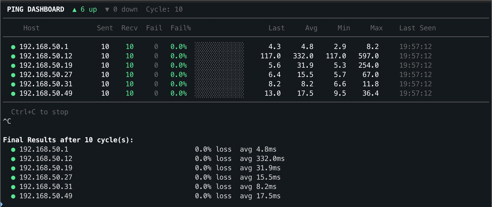

# pingdash

A PingInfoView-style CLI ping dashboard for macOS and Linux. Uses `fping` for true ICMP ping with a live color-coded terminal display.

Built as a native replacement for [PingInfoView](https://www.nirsoft.net/utils/multiple_ping_tool.html) (Windows-only) — useful for monitoring node health during rolling upgrades, network cutovers, or any situation where you need to watch a group of hosts come up and down.



## Features

- Live auto-refreshing table with color-coded status (green = up, red = down)
- Per-host stats: sent, received, failed, fail %, latency (last/avg/min/max), last seen
- Visual fail bar per host — instantly spot problematic nodes
- Staggered batching — prevents false timeouts on large host lists
- Flexible input: args, file, pipe, or interactive paste
- IP range expansion: `10.0.0.1-5` expands to `.1` through `.5`
- CSV export on exit
- Configurable interval, timeout, retries, and batch size
- No dependencies beyond `fping`

## Install

```bash
# macOS
brew install fping

# Linux (Debian/Ubuntu)
sudo apt install fping
```

No Python packages needed — uses only the standard library.

## Usage

```bash
# Interactive — paste IPs when prompted
python3 pingdash.py

# Pass hosts as arguments
python3 pingdash.py 10.0.0.1 10.0.0.2 10.0.0.3

# IP range shorthand
python3 pingdash.py 10.0.0.1-5

# Read from file
python3 pingdash.py -f hosts.txt

# Pipe input
echo "10.0.0.1
10.0.0.2" | python3 pingdash.py

# Custom interval and timeout
python3 pingdash.py -i 3 -t 1000 10.0.0.1-10

# Export CSV on exit
python3 pingdash.py --csv results.csv 10.0.0.1-5
```

## Options

| Flag | Default | Description |
|------|---------|-------------|
| `-f`, `--file` | — | Read hosts from a file |
| `-i`, `--interval` | 5 | Seconds between ping cycles |
| `-c`, `--count` | unlimited | Stop after N cycles |
| `-t`, `--timeout` | 2000 | Ping timeout in milliseconds |
| `-r`, `--retries` | 1 | fping retries per host before marking failed |
| `-b`, `--batch` | 8 | Hosts per fping batch (prevents contention) |
| `--csv` | — | Export results to CSV on exit |

## Batching

When monitoring many hosts, fping can produce false timeouts if it tries to ping all of them simultaneously. pingdash splits hosts into staggered batches (default: 8 per batch) and runs them sequentially within each cycle. This keeps results accurate without slowing down the overall refresh.

Adjust with `-b` if needed — smaller batches are more accurate, larger batches are faster.

## Input Formats

pingdash accepts any mix of these formats, separated by spaces, commas, or newlines:

- Single IPs: `10.0.0.1`
- Hostnames: `server01.domain.com`
- Ranges: `10.0.0.1-5` (expands to `.1` through `.5`)
- Full ranges: `10.0.0.1-10.0.0.5`

## Example: Monitoring a Rolling Upgrade

```bash
# Monitor all nodes in a storage cluster during a firmware upgrade
python3 pingdash.py -i 3 -f cluster-nodes.txt --csv upgrade-results.csv
```

Watch nodes go red as they reboot, then green as they come back. The fail bar shows you at a glance which nodes had the roughest time. Export the CSV when done for your change record.

## License

MIT
